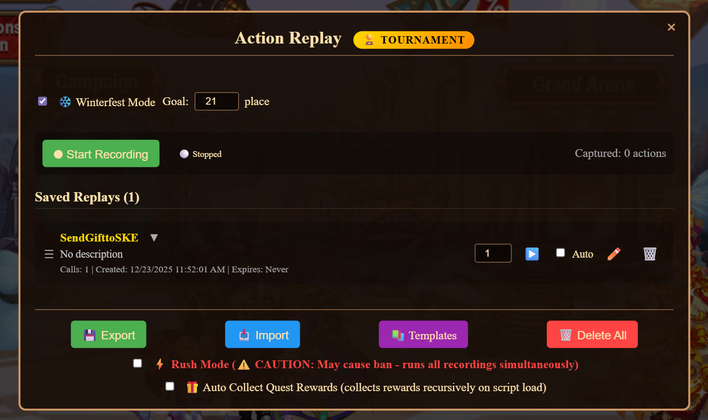

# Winterfest Tournament Guide - Using Action Replay Extension

## Overview

The Action Replay extension includes a powerful **Winterfest Mode** feature that automatically monitors your ranking position and executes recordings to help you maintain or improve your position in the Winterfest tournament leaderboard.

⚠️ **IMPORTANT REQUIREMENT**: **You must be ranked in the tournament (appear in the top 50 leaderboard) for this tool to work correctly.** If you are not ranked, the tool will only display your UserID but cannot execute recordings automatically.

## How It Works

1. **Ranking Monitoring**: The extension checks your ranking every 3 seconds
2. **Automatic Execution**: If your place drops below your goal, it automatically runs all your recordings
3. **Continuous Loop**: After recordings complete, it checks your ranking again and repeats as needed
4. **Ranking Requirement**: The tool requires you to have a ranking position (place) to compare against the goal

## Setup Instructions

### Step 1: Ensure You Are Ranked

⚠️ **CRITICAL**: Before using Winterfest Mode, you must be ranked in the tournament (appear in the top 50 leaderboard). The tool requires your ranking position to function correctly.

**How to check if you're ranked:**
- Open the Winterfest ranking in-game
- If you see your name/position in the top 50 list, you are ranked
- If you don't appear in the list, you need to send gifts to get ranked first

### Step 2: Enable Winterfest Mode

1. Open the **Action Replay** dashboard from the HWH menu
2. Check the **❄️ Winterfest Mode** checkbox
3. Set your **Goal** place (default is 50)
   - Goal place 0 = Monitor only (shows 1st place and your ranking)
   - Goal place 1-50 = Target ranking position

**Example Settings:**



*In this example: Winterfest Mode is enabled, Goal is set to 21, and there is one recording saved ("SendGifttoSKE")*

### Step 3: Create Recordings for Winterfest Actions

Before enabling Winterfest Mode, you need to record the actions you want to execute automatically:

#### Recording Gift-Sending Actions

1. Click **⏺ Start Recording** in the dashboard
2. Perform your gift-sending actions in the game:
   - Send gifts to friends/alliance members
   - Complete any actions that improve your ranking
3. Click **⏹ Stop Recording**
4. Save the recording with a descriptive name (e.g., "Send Gifts Batch 1")
5. **Important**: You don't need to check the "Auto" checkbox for winterfest recordings - the winterfest loop will run ALL recordings regardless of the Auto setting

#### Tips for Effective Recordings

- **Create multiple recordings** for different gift-sending strategies
- **Test recordings manually first** to ensure they work correctly
- **Use repeat counts** to send multiple batches in one recording
- **Keep recordings focused** - one recording per action type works best

### Step 4: Configure Goal Place

- **Goal Place 1-10**: For competitive players aiming for top positions
- **Goal Place 11-30**: For players targeting good rewards
- **Goal Place 31-50**: For players aiming to stay in the ranking
- **Goal Place 0**: Monitor mode only (no automatic execution)

**How Goal Place Works:**
- If your current place is **worse** (higher number) than the goal, recordings execute automatically
- Example: Goal = 20, Your Place = 25 → Recordings will run
- Example: Goal = 20, Your Place = 15 → No execution (you're already above goal)

### Step 5: Verify Winterfest Mode is Working

Once you have recordings ready and Winterfest Mode is enabled:

1. Ensure **❄️ Winterfest Mode** is checked
2. Set your desired **Goal** place
3. **Verify you are ranked**: Check the console - you should see "My Ranking: Place X" messages
4. The extension will start checking your ranking every 3 seconds
5. When your place drops below the goal, all recordings will execute automatically

**If you see "not ranked" messages:**
- You need to manually send gifts to get into the top 50 first
- Once ranked, the tool will automatically maintain your position

## Understanding the Console Output

When Winterfest Mode is active, you'll see console messages every 3 seconds:

### When Goal = 0 (Monitor Mode)
```
Action Replay: Winterfest Ranking - 1st Place: User 12345, GiftsSum: 5000
Action Replay: Winterfest Ranking - My Ranking: Place 15, UserID: 67890, GiftsSum: 3200
```

### When Goal > 0 (Auto-Execute Mode)
```
Action Replay: Winterfest Ranking - Goal Place 20: User 11111, GiftsSum: 3500
Action Replay: Winterfest Ranking - My Ranking: Place 25, UserID: 67890, GiftsSum: 3200
Action Replay: Winterfest Ranking - Difference: -300 (My GiftsSum - Goal Place GiftsSum)
Action Replay: Winterfest Ranking - My place (25) is lower than goal (20), executing recordings...
Action Replay: Winterfest - Executing 3 recording(s)...
Action Replay: Winterfest - All recordings completed, resuming ranking check...
```

### If You're Not Ranked
```
Action Replay: Winterfest Ranking - My UserID: 67890 (not ranked - tool requires you to be ranked to work correctly)
```

⚠️ **Important**: If you see this message, you need to manually send gifts to get ranked in the top 50 before the tool can work automatically.

## Best Practices

### 1. Recording Strategy

- **Create focused recordings**: One recording per action type
  - Example: "Send Gifts to Alliance"
  - Example: "Complete Daily Quests"
  - Example: "Collect Rewards"

- **Use repeat counts wisely**: 
  - Set repeat count to send multiple batches
  - Test to find the optimal batch size

- **Test before enabling**: Always test recordings manually first

### 2. Goal Place Strategy

- **Start conservative**: Set goal to 50 initially to test the system
- **Gradually improve**: Once comfortable, lower your goal place
- **Monitor performance**: Watch console output to understand ranking changes

### 3. Rush Mode Considerations

⚠️ **Warning**: Rush Mode runs all recordings simultaneously, which may:
- Trigger rate limiting
- Cause API errors
- Risk account restrictions

**Recommendation**: Use Rush Mode only if you understand the risks and have tested it thoroughly.

### 4. Recording Management

- **Keep recordings organized**: Use descriptive names
- **Remove outdated recordings**: Delete recordings that no longer work
- **Update recordings**: If game mechanics change, update your recordings

### 5. Monitoring and Adjustments

- **Watch the console**: Monitor the ranking updates
- **Adjust goal place**: Lower it as you improve your position
- **Check recording effectiveness**: If your place keeps dropping, your recordings may need adjustment

## Troubleshooting

### Recordings Not Executing

1. **Check if you're ranked**: The tool requires you to be in the top 50 to work
   - Look for "not ranked" messages in console
   - If not ranked, manually send gifts to get into the leaderboard first
2. **Check Winterfest Mode**: Ensure the checkbox is enabled
3. **Verify Goal Place**: Make sure it's set correctly (not 0 if you want auto-execution)
4. **Check Console**: Look for error messages
5. **Verify Recordings**: Ensure you have recordings saved
6. **Verify Ranking Data**: Check that console shows "My Ranking: Place X" (not "not ranked")

### Place Not Improving

1. **Check Recording Content**: Verify recordings actually send gifts/perform actions
2. **Test Manually**: Run recordings manually to confirm they work
3. **Check Repeat Counts**: Ensure repeat counts are set appropriately
4. **Monitor Competition**: Other players may be sending gifts faster

### Too Many Executions

1. **Raise Goal Place**: Set a higher goal to reduce execution frequency
2. **Check Rush Mode**: Disable Rush Mode if enabled
3. **Review Recordings**: Ensure recordings aren't too aggressive

## Advanced Tips

### 1. Multiple Recording Sets

Create different recording sets for different times:
- Morning recordings (when you have more resources)
- Evening recordings (maintenance mode)
- Emergency recordings (when you're about to drop out)

### 2. Goal Place Adjustment Strategy

- **Start of tournament**: Set goal to 50 (stay in ranking)
- **Mid tournament**: Lower to 30-40 (improve position)
- **End of tournament**: Lower to 10-20 (compete for top spots)

### 3. Monitoring Strategy

- **Goal = 0 initially**: Monitor your position and competition
- **Set realistic goal**: Based on your resources and competition level
- **Adjust dynamically**: Change goal based on tournament progress

### 4. Resource Management

- **Track resource usage**: Monitor how many gifts/resources you're using
- **Set limits**: Create recordings that respect your resource limits
- **Plan ahead**: Ensure you have enough resources for the tournament duration

## Safety Considerations

⚠️ **Important Warnings:**

1. **Rate Limiting**: Too many rapid API calls may trigger rate limiting
2. **Account Safety**: Use Rush Mode with caution - it may be detected as unusual activity
3. **Resource Management**: Automatic execution can consume resources quickly
4. **Monitoring**: Always monitor the extension's behavior, especially when first enabled

## Example Workflow

### Day 1: Setup
1. Create 3-5 recordings for gift-sending actions
2. Test each recording manually
3. Set goal place to 50
4. Enable Winterfest Mode
5. Monitor console output for 10-15 minutes

### Day 2-3: Optimization
1. Review ranking performance
2. Adjust goal place based on results
3. Refine recordings if needed
4. Continue monitoring

### Final Days: Competition
1. Lower goal place to target position
2. Ensure all recordings are working
3. Monitor closely during final hours
4. Adjust goal as needed to maintain position

## Console Output Reference

### Ranking Check (Every 3 seconds)
```
Action Replay: Winterfest Ranking - Goal Place X: User Y, GiftsSum: Z
Action Replay: Winterfest Ranking - My Ranking: Place A, UserID: B, GiftsSum: C
Action Replay: Winterfest Ranking - Difference: +/-D
```

### Execution Trigger
```
Action Replay: Winterfest Ranking - My place (X) is lower than goal (Y), executing recordings...
Action Replay: Winterfest - Executing N recording(s)...
```

### Completion
```
Action Replay: Winterfest - All recordings completed, resuming ranking check...
```

## Summary

The Winterfest Mode feature automates the process of maintaining your tournament ranking by:
- ✅ Monitoring your position every 3 seconds
- ✅ Automatically executing all recordings when your place drops
- ✅ Waiting for completion before the next check
- ✅ Providing detailed console output for monitoring

With proper setup and monitoring, this feature can help you maintain or improve your Winterfest tournament ranking with minimal manual intervention.

**Remember**: Always test your recordings manually first, monitor the console output, and adjust your goal place based on your resources and competition level.

